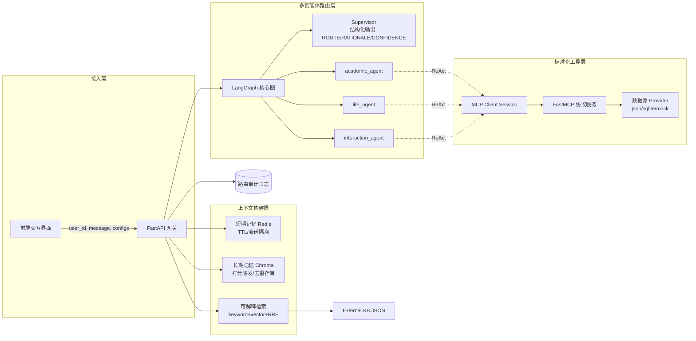

# 🌟 BUPT Campus Smart Life Assistant Agent

> **北邮校园智能生活助手** —— 融合 LangGraph 多智能体架构、可解释混合 RAG、长短期记忆治理与 MCP 标准协议的综合性 AI Agent 平台。

## 🎯 项目定位与核心价值

本项目旨在为高校师生提供一个**统一的自然语言交互入口**，解决教务查询、食堂推荐、跳蚤市场等场景中信息碎片化的问题。从工程角度，告别“单体黑盒大模型”，实现**路由可控、检索可释、记忆防污、工具解耦**的工业级 Agent 架构。

## 🏗️ 核心架构拆解



## ✨ 核心亮点特性

1. **工程化多 Agent 路由 (LangGraph)**
   - Supervisor 基于结构化输出进行决策，确保路径收敛。通过保留 `ROUTE`、`RATIONALE` 与 `CONFIDENCE`，实现思维链（CoT）的可观测与审计。
2. **透明可解释 RAG (Explainable Hybrid RAG)**
   - **多路召回**：轻量级向量匹配 + 关键词 TF-IDF 匹配。
   - **融合重排**：RRF (Reciprocal Rank Fusion) 结合 Token Overlap 轻量重排。
   - **全面可释**：每条候选均返回 `source_id` 及各阶段得分，杜绝“黑盒推荐”，在前端或 API 直接附“参考片段来源”。
3. **精细化记忆治理 (Multi-tier Memory)**
   - **隔离与时效**：短期记忆基于 Redis 队列，自动 TTL 防膨胀。
   - **抗污染写入**：长期记忆拒绝纯规则捕获，改用“模型打分阈值+文本哈希去重”双重校验，且支持分层定点清除。
4. **标准化 MCP 协议栈 (Model Context Protocol)**
   - 抛弃强绑定的本地函数直调，引入官方 Python SDK 的 FastMCP 注册及 stdio_client 调用。
   - 实现工具集底层解耦，后续接入校园真实数据源或扩充跨域服务时，无需改动 Agent 推测链路。

## 🚀 快速上手

### 1) 环境与依赖
```bash
pip install -r requirements.txt
cp .env.example .env
```
在 `.env` 中按需填写 `OPENAI_API_KEY`、`OPENAI_BASE_URL` 以及 `LLM_MODEL`。

### 2) 启动服务
```bash
python -m uvicorn app.main:app --host 0.0.0.0 --port 8000 --reload
```
- **Web UI**: http://localhost:8000/
- **API Docs**: http://localhost:8000/docs
- 支持在前端侧边栏动态配置 API Key 与模型网关参数，实现不同环境一键联调。

## 🛡️ 开源与工程安全
- 密钥级配置通过 `.env` 与前端本地 `localStorage` 隔离。
- 提供错误兜底隔离（Fallback），MCP 协议工具崩溃时自动切换本地后验兜底。
- 内置针对敏感凭证（API Token/DB Conn）的忽略防线 `.gitignore`。
